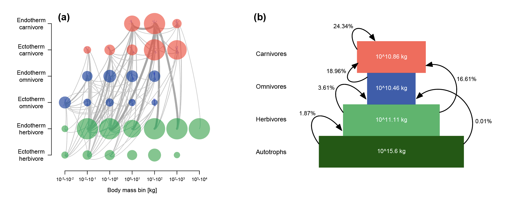

# Basic use

### Model initialisation

The function ```madingley_init()``` initialises a model run by generating a cohort and stock data set. Both data sets are returned as data frames in a list object (here named: ```mdata```) after the ```madingley_init()``` finishes. The cohort data set contains functional information for all cohorts (i.e. heterotrophs) needed to run a Madingley simulation (```mdata$cohorts```). The stock data set holds the functional information concerning the stocks (i.e. photo-autotrophs) (```mdata$stocks```). The generated data sets are based on the functional definitions defined in ```cohort_def``` (cohort definitions) and ```stock_def``` (stock definitions). ```spatial_window``` defines the boundaries of the spatial location, formatted as a vector containing four coordinates in the following order: 1) minimum longitude, 2) maximum longitude, 3) minimum latitude and 4) maximum latitude. The R code shown below illustrates the use of the ```madingley_init()``` function for an area that includes the Serengeti. 

```R
# Load package
library(MadingleyR)

# Spatial model domain = c(min_long, max_long, min_lat, max_lat)
spatial_window = c(31, 35, -5, -1)

# Load inputs manually
madingley_inputs( ) # prints the possible input options to the R console
sptl_inp = madingley_inputs('spatial inputs')
chrt_def = madingley_inputs('cohort definition')
stck_def = madingley_inputs('stock definition')
mdl_prms = madingley_inputs('model parameters') # useful later for running the model

# Initialise model the model using the pre-loaded inputs
mdata = madingley_init(spatial_window = spatial_window,
                       cohort_def = chrt_def,
                       stock_def = stck_def,
                       spatial_inputs = sptl_inp
                       )
```


### Running the Madingley model

After generating cohorts and stocks, a simulation can be started using the ```madingley_run()``` function. The ```madingley_run()``` function requires the initialisation data set produced by the ```madingley_init()``` function. A typical Madingley simulation first requires a spin-up phase that allows ecosystem components to reach a stable state. This phase usually consists of a 100 to 1000-year model simulation without any model user induced changes. The code below runs the Madingley model for 100 years (```years = 100```) using the previously generated ```mdata``` object. The standard model input variables (e.g. cohort definitions, stock definitions, spatial inputs and/or model parameters) can be changed for ```madingley_run()``` via the following input parameters: ```cohort_def```, ```stock_def```, ```spatial_inputs```, ```model_parameters```.


```R
# Run the Madingley model
mdata2 = madingley_run(madingley_data = mdata, 
                       years = 100, 
                       cohort_def = chrt_def, 
                       stock_def = stck_def, 
                       spatial_inputs = sptl_inp, 
                       model_parameters = mdl_prms)
```

### Creating plots

The ```madingley_plot()``` function creates several plots (see figures below) from the outputs generated by ```madingley_run()```. The individuals plots can also be produced one by one using the functions presented the documentation (see code below).

```R
# Create all MadingleyR plots
madingley_plot(mdata2) 

# Check documentation to make individual plots
?madingley_plots
```
<p>

<br>
<em>Total log10(biomass in kg) per feeding guild over time (a) and the biomass density per log10-binned body mass category (in g) (b). The plots were made using the default plotting functions included in the MadingleyR package. The biomass density plots represent the yearly average biomass density extracted for the last simulation year. The total simulation time was set to 100 years, the selected spatial model domain included the area between 31 to 35 longitude and -5 to -1 latitude.</em>
<br>
<br>
<br>
</p>

<p>

<br>
<em>Log10-binned food-web (a) and trophic pyramid (b) plotted using the functions included in MadingleyR. Each circle in first panel (a) represents all cohorts within the designated category and the size of the circles in represent the relative differences in total biomass. Grey lines connecting the circles illustrate the flows between grouped cohorts. The trophic pyramid illustrated in second panel (b) shows the total biomass (in kg) of four feeding guilds (coloured boxes) and the relative amount of biomass flowing between them (arrows). Plots are based on the outputs produced during the final year of a 100-year simulation using the same model domain used to create Figure 2 (31 to 35 longitude and -5 to -1 latitude).</em>
<br>
<br>
<br>
</p>

<p>

<br>
<em>The yearly average total biomass (in log10) plotted per grid cell and per included functional group. The yearly average biomass was computed over the last simulation year.  The total simulation time (100 years) as well as the spatial model domain (31 to 35 longitude and -5 to -1 latitude) were set in the R code presented in the text. The plot was made using one of the default plotting functions included in the MadingleyR package.</em>
</p>

<br/>

