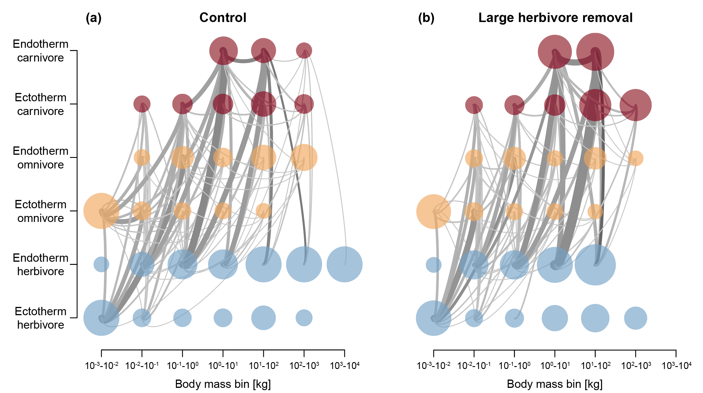

## Case study 1

To investigate the role of large and megaherbivores in the Serengeti, we removed endothermic herbivores with a body mass >100 kg from the simulation. First, we need to load the ```MadingleyR``` package and select the spatial window:

```R
library(MadingleyR)

# Set model params
spatial_window = c(31, 35, -5, -1) # region of interest: Serengeti
```

Because the spatio-temporal inputs set the maximum body masses for endotherms we can control the maximum size of e.g. carnivores and omnivores allowed in the simulation, in this case the spatial inputs are raster files and we set all cells within the raster to the same value (e.g. 200 kg for omnivores):

```R
sptl_inp = madingley_inputs('spatial inputs') # load default inputs

# set the maximum body masses of the functional groups manually
sptl_inp$Endo_O_max[ ] = 200000 # set max size omnivores = 200000 g (200 kg)
sptl_inp$Endo_C_max[ ] = 600000 # set max size carnivores = 600000 g (600 kg)
sptl_inp$Ecto_max[ ] = 150000 # set max size ectotherms = 150000 g (150 kg)
```

Next, we can initialise the model using we use the spatial inputs (named ```sptl_inp```) modified above. Note that the cohort and stock definitions are not loaded in this example. Both ```madingley_init()``` and ```madingley_run()``` will load the default definitions automatically in the case none are provided to the function call and the default values will suffice.

```R
# Initialise model
mdata = madingley_init(spatial_window = spatial_window, spatial_inputs = sptl_inp)
```

After the ```mdata``` object is returned by the initialisation process, we can run a simulation for a 100-year period without any intervention, referred to as the model spin-up. The outputs are in this case written to ```C:/MadingleyOut```, which can be changed depending on preference and the operating system. Please note that if the output folder is not set within the ```madingley_run()``` function, the outputs will be stored in the temporary folder of ```R```, they can still be used to create plots or run consecutive simulations. If ```out_dir``` is set to ```C:/MadingleyOut``` make sure this folder exists or modify the path before running the code.

```R
# Run spin-up of 100 years (output results to C:/MadingleyOut)
mdata2 = madingley_run(out_dir = 'C:/MadingleyOut', 
                       madingley_data = mdata, 
                       spatial_inputs = sptl_inp, 
                       years = 100)
```
After the model spin-up we first run a control, this can be done by continuing the simulation for an additional 50 years using ```mdata2```.

```R
# Run 50-year control simulation (for later comparison)
mdata3 = madingley_run(madingley_data = mdata2, years = 50, spatial_inputs = sptl_inp)
```
Then we can use ```mdata2``` again for a new simulation run, but this time without all endothermic herbivore cohorts with a body mass of >100 kg. To do this we first removed the large herbivores from ```mdata2```:

```R
# Remove large (>100 kg) endothermic herbivores from mdata$cohorts
remove_idx = which(mdata2$cohorts$AdultMass > 1e5 & 
                   mdata2$cohorts$FunctionalGroupIndex == 0)
mdata2$cohorts = mdata2$cohorts[-remove_idx, ]
```
And then the modified object was used to run a consecutive simulation of 50 years. 

```R
# Run large herbivore removal simulation (for 50 years)
mdata4 = madingley_run(madingley_data = mdata2, years = 50, spatial_inputs = sptl_inp) 
```
Food-web results can be plotted for means of comparison between the control and removal simulation. 

```R
# Make plots
par(mfrow = c(1, 2))
plot_foodweb(mdata3, max_flows = 5) # control food-web plot
plot_foodweb(mdata4, max_flows = 5) # large-herbivore removal food-web plot
```
<!-- 

-->

<p align="center">

<br>
<em>Log10-binned food-web plots constructed from a control simulation (a) and a simulation in which large and mega (>100 kg) endothermic herbivores were removed (b). Node colour depicts feeding category: carnivores (red), omnivores (orange) and herbivores (blue). Grey lines connecting the nodes illustrate the flows between grouped cohorts. These results can be replicated, without any further dependencies, using the code shown in the main text.</em>
<br>
<br>
<br>
</p>
