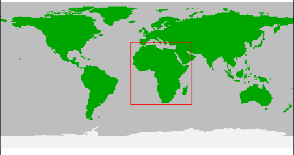
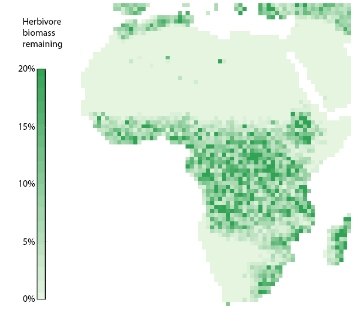

## Case study 3

Please note that running this case study requires significantly more processing power and/or time compared to the previous case studies because of the spatial scale (the amount of model grid cells to process). The code was tested on a Dell XPS15 with a i7-8750H (6 core) processor and 16 gb memory, the total run time of the script was 13 hours and 31 minutes. Although it can be run on a laptop, we suggest running this on a powerful desktop or server, or reduce the study area.

```R
library(MadingleyR)

# Set spatial window
spatial_window = c(-20, 55, -36, 40) # full study area
# spatial_window =  c(32, 34, -4, 0) # to set a smaller test region

# Can be used to check if we defined the spatial window correctly
plot_spatialwindow(spatial_window) 

# Load spatial inputs
sptl_inp = madingley_inputs('spatial inputs') # load default inputs
```

<!-- 

--->

<p align="center"><br><em>spatial window</em><br><br><br></p>

Next, we determine how long each of the simulation phases will run for.

```R
# Set years
years_spinup = 200
years_vegred = 5
years_postred = 200
```

To speed up the simulation time we set the number of maximum cohorts in each grid cell to 350 (by default ```max_cohort = 1000```). This will lower the number of interactions between cohorts and therefore reduce the model run time. In addition, within the cohort definitions, we set the number of cohorts to initiate per functional group to 35. In this case we run the model with all 9 default functional groups, which will make the total number of cohorts initialised per grid cell 315 (9 * 35). This means that during the simulation run, the total number of cohorts per grid cell is allowed to grow to 350 (when cohorts reproduce or disperse to other grid cells), however, once the number of cohorts per grid cell is larger than 350, cohort merging will take please. Cohorts with very similar properties will be merged within the grid cell.

```R
# Load cohort definitions
chrt_def = madingley_inputs('cohort definition')
chrt_def[,13] = 35
max_chrt = 350

# Initialize model
mdata = madingley_init(spatial_window = spatial_window, 
                       spatial_inputs = sptl_inp,
                       max_cohort = max_chrt,
                       cohort_def = chrt_def)
```

Next, we run the model for 200 years, outputting the results into ```~/Desktop/TempMadingleyOuts/```

```R
# Run spin-up of 200 years 
mdata2 = madingley_run(madingley_data = mdata, 
                       years = years_spinup,
                       spatial_inputs = sptl_inp, 
                       max_cohort = max_chrt,
                       cohort_def = chrt_def,
                       output_timestep = rep(years_spinup-1,4),
                       out_dir = "~/Desktop/TempMadingleyOuts/")
```
When performing larger simulations it can be useful to save the R environment (```save.image```) at some stages in the script. This will make it easier to continue the simulation at a later stage if parameters or the simulation setup need to be altered. In this case we have a 200 year model spin-up, which we can for example use in other simulation experiments.

```R
save.image("~/Desktop/TempMadingleyOuts/env_sinup.RData")
```

Next, we load the default model parameters and perform 19 consecutive simulations (the input for simulation ```i + 1``` is the output of simulation ```i```). In each consecutive simulation we reduce the growth of autotrophs by 5%. This is done by modifying the default model input parameters ```m_params```. ```m_params[86, ]$notes``` provides additional information on this specific parameter. For this parameter the default value is 1.0 (autotroph production is at 100%), by reducing it each 5 years by 0.05 until we reach 0.05, we gradually reduced autotroph production to 5%.

```R
# Set scenario parameters
m_params = madingley_inputs('model parameters') # load default model parameters
mdata_list = list(mdata2)

# Loop over land-use intensities
for(i in 1:19) {
  
  # Reduce available stock biomass every iteration by 10%
  m_params[86, 2] = 1 - i * 0.05
  print(m_params[86, 2])
  
  # Run model with reduced stock availability
  mdata_list[[i+1]] = madingley_run(madingley_data = mdata_list[[i]], 
                                    years = years_vegred,
                                    model_parameters = m_params, 
                                    spatial_inputs = sptl_inp,
                                    max_cohort = max_chrt,
                                    cohort_def = chrt_def,
                                    silenced = TRUE,
                                    out_dir = "~/Desktop/TempMadingleyOuts/")
  
}
```

After the reduction in autotroph production we run the model for an additional 200 years to allow the model to stabilise. During this simulation we keep the autotroph production at 5% (```m_params[86, 2] = 0.05```). 

```R
# Run model for additional 100 years
m_params[86, 2] = 0.05
mdata4 = madingley_run(madingley_data = mdata_list[[20]], 
                       years = years_postred,
                       model_parameters = m_params, 
                       spatial_inputs = sptl_inp,
                       cohort_def = chrt_def,
                       max_cohort = max_chrt,
                       out_dir = "~/Desktop/TempMadingleyOuts/")

```

Finally we compare the end state of the model before the autotroph reduction to the end state of the model after the autotroph reduction using a spatial plot.

```R
# Create plot
herb_bef = plot_spatialbiomass(mdata2, functional_filter = TRUE, plot = FALSE)[[1]]
herb_red = plot_spatialbiomass(mdata4, functional_filter = TRUE, plot = FALSE)[[1]]
r = (10^herb_red/10^herb_bef)*100 # calculate % difference
r[] = ifelse(herb_bef[]==0,0,r[]) # remove values were no herbivores were present
r_max = ceiling(quantile(r[],na.rm=TRUE,seq(0,1,0.05))["95%"]) 
r[] = ifelse(r[]>r_max,r_max+1e-9,r[])
plot(r,colNA="white", axes = FALSE, box = FALSE, legend = FALSE,
     col = colorRampPalette(c("#e5f5e0","#31a354"))(20),zlim=c(0,(r_max+1e-9)))
plot(r, legend.only=TRUE, col=colorRampPalette(c("#e5f5e0","#31a354"))(20),
     legend.width=1, legend.shrink=0.75, 
     legend.mar = 42, axis.args=list(at=seq(0,r_max,5), 
     labels=seq(0,r_max,5), cex.axis=0.6),
     legend.args=list(text='Herbivores\n remaining (%)', 
     side=3, font=2, line=2.5, cex=0.8))
```

<!--

-->


<p align="center">

<br>
<em>Relative reduction in endotherm herbivore biomass after reducting autotroph production by 95%</em>
<br>
<br>
<br>
</p>
