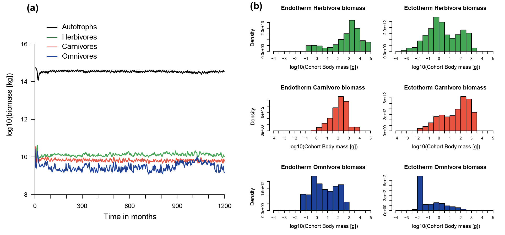

## Creating plots

The ```madingley_plot()``` function creates several plots (see figures below) from the outputs generated by ```madingley_run()``` ([generated here](./RUN.md)). The individuals plots can also be produced one by one using the functions presented the documentation (see code below).

```R
# Create all MadingleyR plots
madingley_plot(mdata2) 

# Check documentation to make individual plots
?madingley_plots
```
<p>

<br>
<em>Total log10(biomass in kg) per feeding guild over time (a) and the biomass density per log10-binned body mass category (in g) (b). The plots were made using the default plotting functions included in the MadingleyR package. The biomass density plots represent the yearly average biomass density extracted for the last simulation year. The total simulation time was set to 100 years, the selected spatial model domain included the area between 31 to 35 longitude and -5 to -1 latitude.</em>
<br>
<br>
<br>
</p>

<p>

<br>
<em>Log10-binned food-web (a) and trophic pyramid (b) plotted using the functions included in MadingleyR. Each circle in first panel (a) represents all cohorts within the designated category and the size of the circles in represent the relative differences in total biomass. Grey lines connecting the circles illustrate the flows between grouped cohorts. The trophic pyramid illustrated in second panel (b) shows the total biomass (in kg) of four feeding guilds (coloured boxes) and the relative amount of biomass flowing between them (arrows). Plots are based on the outputs produced during the final year of a 100-year simulation using the same model domain used to create Figure 2 (31 to 35 longitude and -5 to -1 latitude).</em>
<br>
<br>
<br>
</p>

<p>

<br>
<em>The yearly average total biomass (in log10) plotted per grid cell and per included functional group. The yearly average biomass was computed over the last simulation year.  The total simulation time (100 years) as well as the spatial model domain (31 to 35 longitude and -5 to -1 latitude) were set in the R code presented in the text. The plot was made using one of the default plotting functions included in the MadingleyR package.</em>
</p>

<br/>

