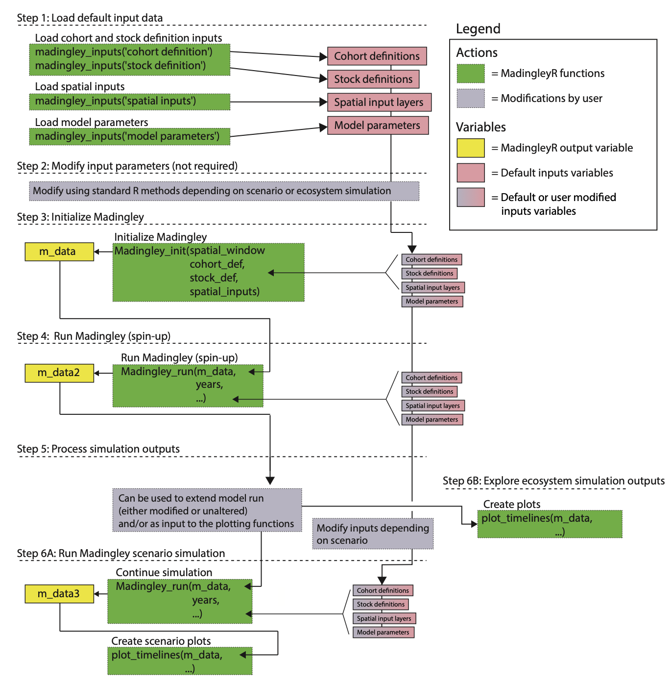

## MadingleyR Installation

The MadingleyR package can be directly installed from R using the ```devtools``` or ```remotes``` R package. The following command installs the package using the remotes R package:

```R
# Load the remotes package
library('remotes') # or use library('devtools')

# Install the MadingleyR package
install_github('MadingleyR/MadingleyR', subdir='Package')
```

In addition to installing the MadingleyR dependencies (```rgdal```, ```sp```, ```data.table``` and ```raster```), the installation process also downloads the precompiled C++ executable, default spatio-temporal input layers and all other default input parameters and includes them in the installation folder.

## Content

* Basic use
  * [Model initialisation](./INIT.md)
  * [Running the Madingley model](./RUN.md)
  * [Creating plots](./PLOT.md)
* Case studies
  * [Case study 1](./CASESTUDY1.md)
  * [Case study 2](./CASESTUDY2.md)
  * [Case study 3](./CASESTUDY3.md)
* Function description
  * [Package manual](./Manual.pdf)

## MadingleyR workflow

<p align="center">

<br>
<em>Overview of the MadingleyR workflow.</em>
<br>
<br>
<br>
</p>

## Contact information

email: NA@na.na


## Useful links

* The package manual is accessible from within R or can be viewed [here](./Manual.pdf)
* Additional information about the package can be found [here](addlink) (paper link not yet available)
* More information about the Madingley model can be found [here](https://journals.plos.org/plosbiology/article?id=10.1371/journal.pbio.1001841)
* The R package code can be found [here](https://github.com/MadingleyR/MadingleyR/tree/master/Package)
* The C++ source code can be found [here](https://github.com/MadingleyR/MadingleyR/tree/master/SourceCode)

