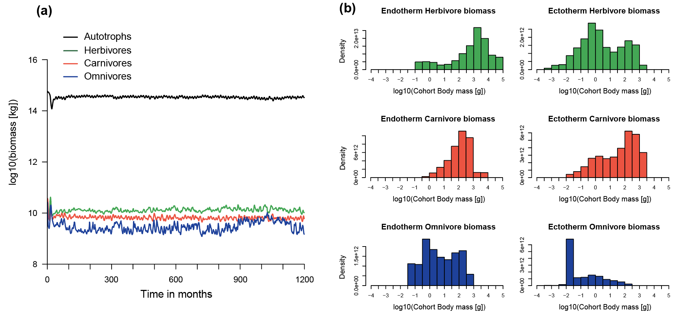
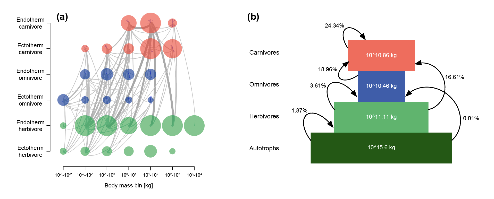
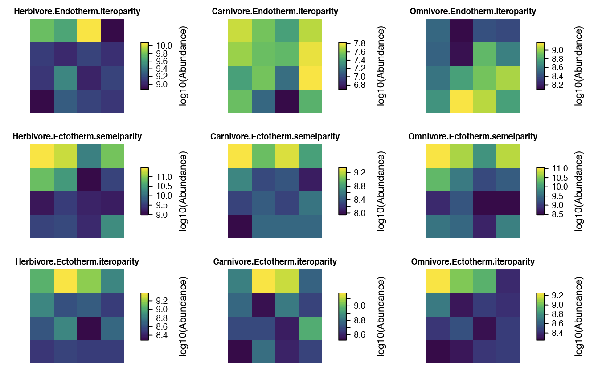
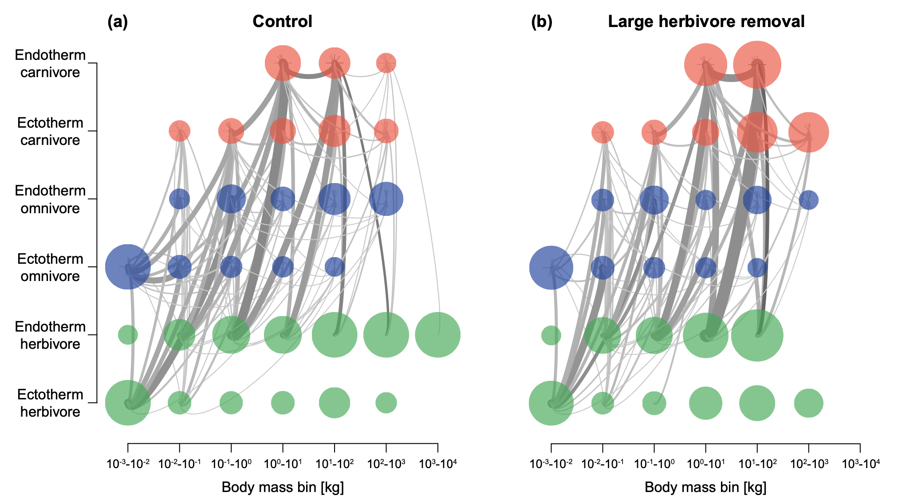
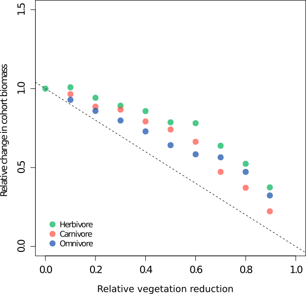

# MadingleyR

### Content

* About
  * [Introduction](#Introduction)
  * [Contact information](#Contact-information)
* Basic use
  * [Installation](#Installation)
  * [Model initialisation](#Model-initialisation)
  * [Running the Madingley model](#Running-the-Madingley-model)
  * [Creating plots](#Creating-plots)
* Case studies
  * [Case study 1 and 2 spin-up](#Case-study-1-and-2-spin-up)
  * [Case study 1](#Case-study-1)
  * [Case study 2](#Case-study-2)
  
<br/>

# About

### Introduction

R package of the Madingley General Ecosystem Model. The MadingleyR R package streamlines the installation procedure and supports all major operating systems. MadingleyR enables users to combine multiple consecutive simulation runs, making case study specific modifications to MadingleyR objects along the way. 

- The package manual is accessible from within R or can be downloaded from [here](https://github.com/MadingleyR/MadingleyR/raw/master/Manual.pdf)
- Additional information about the package can be found [here](addlink) (paper link not yet available)
- More information about the Madingley model can be found [here](https://journals.plos.org/plosbiology/article?id=10.1371/journal.pbio.1001841)

### Contact information

email: NA@na.na

<br/>

# Basic use

### Installation

The MadingleyR package can be directly installed from R using the ```devtools``` or ```remotes``` R package. The following command installs the package using the remotes R package:

```R
# Load the remotes package
library('remotes') # or use library('devtools')

# Install the MadingleyR package
install_github('MadingleyR/MadingleyR', subdir='Package')
```

In addition to installing the MadingleyR dependencies (```rgdal```, ```sp``` and ```raster```), the installation process also downloads the precompiled C++ executable, default spatio-temporal input layers and all other default input parameters and includes them in the installation folder.


### Model initialisation

The function ```madingley_init()``` initialises a model run by generating a cohort and stock data set. Both data sets are returned as data frames in a list object (here named: ```mdata```) after the ```madingley_init()``` finishes. The cohort data set contains functional information for all cohorts (i.e. heterotrophs) needed to run a Madingley simulation (```mdata$cohorts```). The stock data set holds the functional information concerning the stocks (i.e. photo-autotrophs) (```mdata$stocks```). The generated data sets are based on the functional definitions defined in ```cohort_def``` (cohort definitions) and ```stock_def``` (stock definitions). ```spatial_window``` defines the boundaries of the spatial location, formatted as a vector containing four coordinates in the following order: 1) minimum longitude, 2) maximum longitude, 3) minimum latitude and 4) maximum latitude. The R code shown below illustrates the use of the ```madingley_init()``` function for an area that includes the Serengeti. 

```R
# Load package
library(MadingleyR)

# Spatial model domain = c(min_long, max_long, min_lat, max_lat)
spatial_window = c(31, 35, -5, -1)

# Load inputs manually
madingley_inputs( ) # prints the possible input options to the R console
sptl_inp = madingley_inputs('spatial inputs')
chrt_def = madingley_inputs('cohort definition')
stck_def = madingley_inputs('stock definition')
mdl_prms = madingley_inputs('model parameters') # useful later for running the model

# Initialise model the model using the pre-loaded inputs
mdata = madingley_init(spatial_window = spatial_window,
                       cohort_def = chrt_def,
                       stock_def = stck_def,
                       spatial_inputs = sptl_inp
                       )
```


### Running the Madingley model

After generating cohorts and stocks, a simulation can be started using the ```madingley_run()``` function. The ```madingley_run()``` function requires the initialisation data set produced by the ```madingley_init()``` function. A typical Madingley simulation first requires a spin-up phase that allows ecosystem components to reach a stable state. This phase usually consists of a 100 to 1000-year model simulation without any model user induced changes. The code below runs the Madingley model for 100 years (```years = 100```) using the previously generated ```mdata``` object. The standard model input variables (e.g. cohort definitions, stock definitions, spatial inputs and/or model parameters) can be changed for ```madingley_run()``` via the following input parameters: ```cohort_def```, ```stock_def```, ```spatial_inputs```, ```model_parameters```.


```R
# Run the Madingley model
mdata2 = madingley_run(madingley_data = mdata, 
                       years = 100, 
                       cohort_def = chrt_def, 
                       stock_def = stck_def, 
                       spatial_inputs = sptl_inp, 
                       model_parameters = mdl_prms)
```

### Creating plots

The ```madingley_plot()``` function creates several plots (see figures below) from the outputs generated by ```madingley_run()```. The individuals plots can also be produced one by one using the functions presented the documentation (see code below).

```R
# Create all MadingleyR plots
madingley_plot(mdata2) 

# Check documentation to make individual plots
?madingley_plots
```
<p>

<br>
<em>Total log10(biomass in kg) per feeding guild over time (a) and the biomass density per log10-binned body mass category (in g) (b). The plots were made using the default plotting functions included in the MadingleyR package. The biomass density plots represent the yearly average biomass density extracted for the last simulation year. The total simulation time was set to 100 years, the selected spatial model domain included the area between 31 to 35 longitude and -5 to -1 latitude.</em>
<br>
<br>
<br>
</p>

<p>

<br>
<em>Log10-binned food-web (a) and trophic pyramid (b) plotted using the functions included in MadingleyR. Each circle in first panel (a) represents all cohorts within the designated category and the size of the circles in represent the relative differences in total biomass. Grey lines connecting the circles illustrate the flows between grouped cohorts. The trophic pyramid illustrated in second panel (b) shows the total biomass (in kg) of four feeding guilds (coloured boxes) and the relative amount of biomass flowing between them (arrows). Plots are based on the outputs produced during the final year of a 100-year simulation using the same model domain used to create Figure 2 (31 to 35 longitude and -5 to -1 latitude).</em>
<br>
<br>
<br>
</p>

<p>

<br>
<em>The yearly average total biomass (in log10) plotted per grid cell and per included functional group. The yearly average biomass was computed over the last simulation year.  The total simulation time (100 years) as well as the spatial model domain (31 to 35 longitude and -5 to -1 latitude) were set in the R code presented in the text. The plot was made using one of the default plotting functions included in the MadingleyR package.</em>
</p>

<br/>

# Case studies

### Case study 1 and 2 spin-up

```R
library(MadingleyR)
setwd('C:/MadingleyOut') # create this directory if it does not exist

# Set model params
spatial_window = c(31, 35, -5, -1) # region of interest: Serengeti
sptl_inp = madingley_inputs('spatial inputs') # load default inputs

# set the maximum body masses of the functional groups manually
sptl_inp$Endo_O_max[ ] = 2e+05 # set max size omnivores = 200 kg
sptl_inp$Endo_C_max[ ] = 6e+05 # set max size carnivores = 600 kg
sptl_inp$Ecto_max[ ] = 1.5e+05 # set max size ectotherms = 150 kg

# Initialize model
mdata = madingley_init(spatial_window = spatial_window, spatial_inputs = sptl_inp)

# Run spin-up of 100 years (output results to C:/MadingleyOut)
mdata2 = madingley_run(out_dir = 'C:/MadingleyOut', 
                       madingley_data = mdata, 
                       spatial_inputs = sptl_inp, 
                       years = 100)

# Save environment
save(mdata2, sptl_inp, file = 'model_spin_up.RData')

```

### Case study 1

```R
# Load model spin-up
load('C:/MadingleyOut/model_spin_up.RData')

# Run 50-year control simulation (for later comparison)
mdata3 = madingley_run(madingley_data = mdata2, years = 50, spatial_inputs = sptl_inp)

# Remove large (>100 kg) endothermic herbivores from mdata$cohorts
remove_idx = which(mdata2$cohorts$AdultMass > 1e+5 & mdata2$cohorts$FunctionalGroupIndex == 0)
mdata2$cohorts = mdata2$cohorts[-remove_idx, ]

# Run large herbivore removal simulation
mdata4 = madingley_run(madingley_data = mdata2, years = 50, spatial_inputs = sptl_inp) 

# Make plot
par(mfrow = c(1, 2))
plot_foodweb(mdata3, max_flows = 5) # control food-web plot
plot_foodweb(mdata4, max_flows = 5) # large-herbivore removal food-web plot
```
<p>

<br>
<em>Log10-binned food-web plots construction from a control simulation (a) and a simulation in which large and mega (>100 kg) endothermic herbivores were removed (b). Node colour depicts feeding category: carnivores (red), omnivores (blue) and herbivores (green). Grey lines connecting the nodes illustrate the flows between grouped cohorts. These results can be replicated, without any further dependencies, using the code shown in the main text.</em>
<br>
<br>
<br>
</p>

### Case study 2

```R
# Load model spin-up
load('C:/MadingleyOut/model_spin_up.RData')

# Set scenario parameters
reps = 10 # set number of replicas per land-use intensity
avail_bio = sort(rep(seq(1.0, 0.2, -0.1), reps), decreasing = T) # accessible biomass
m_params = madingley_inputs('model parameters') # load default model parameters
fg = c('Herbivore', 'Carnivore', 'Omnivore') # vector for aggregating cohorts
stats = data.frame() # used to store individual model output statistics

# Loop over land-use intensities
for(i in 1:length(avail_bio)) {
 m_params[28, 2] = avail_bio[i] # accessible biomass (see model parameters)
 
 cohorts = madingley_run(
  years = 5, 
  madingley_data = mdata2, 
  model_parameters = m_params, 
  spatial_inputs = sptl_inp)$cohorts # store cohort results only
 
 # Calculate cohort biomass
 cohorts$Biomass = cohorts$CohortAbundance * cohorts$IndividualBodyMass 
 cohorts = cohorts[cohorts$FunctionalGroupIndex<3, ] # only keep endotherms
 cohorts = aggregate(cohorts$Biomass, by = list(fg[cohorts$FunctionalGroupIndex + 1]), sum)
 stats = rbind(stats, cohorts) # attach aggregated stats
}

# Calculate mean relative (to control) response per replica simulation
stats$veg_reduced = sort(rep(1 - avail_bio, 3))
m = aggregate(stats$x, by = list(stats$veg_reduced, stats$Group.1), FUN = mean)
m$x_rel = NA;
for(i in fg) { 
 m$x_rel[m$Group.2 == i] = m$x[m$Group.2 == i]/m$x[m$Group.2 == i][1] 
}

# Make final plots
plot(1 - unique(red_avail_bio), m$x_rel[m$Group.2 == 'Herbivore'], 
     col= 'green', pch = 19, ylim = c(0, 1.5), xlim = c(0, 1),
     xlab = 'Relative vegetation biomass inaccessible', ylab = 'Relative change in cohort biomass')
points(1 - unique(red_avail_bio), m$x_rel[m$Group.2 =='Carnivore'], col= 'red', pch = 19)
points(1 - unique(red_avail_bio), m$x_rel[m$Group.2 == 'Omnivore'], col = 'blue', pch = 19)
abline(1, -1, lty = 2)
legend(0.0, 0.2, fg, col=c('green', 'red', 'blue'), pch = 19, box.lwd = 0)

```
<p>

<br>
<em>Relative change in biomass of endotherm cohorts compared to the control simulation (biomass experiment/biomass control) plotted against the proportion of plant biomass made inaccessible to herbivores and omnivores. A relative change in biomass of 1 indicates no change. Data points represent the relative change in biomass of endothermic carnivores (red), omnivores (blue) and herbivores (green) averaged over 10 replicas extracted at the end of the 5-year simulation experiment. The dashed line indicates the impact expected if the biomass of endotherms decreased linearly with the amount of plant made inaccessible for feeding (i.e. y = −x).</em>
<br>
<br>
<br>
</p>
